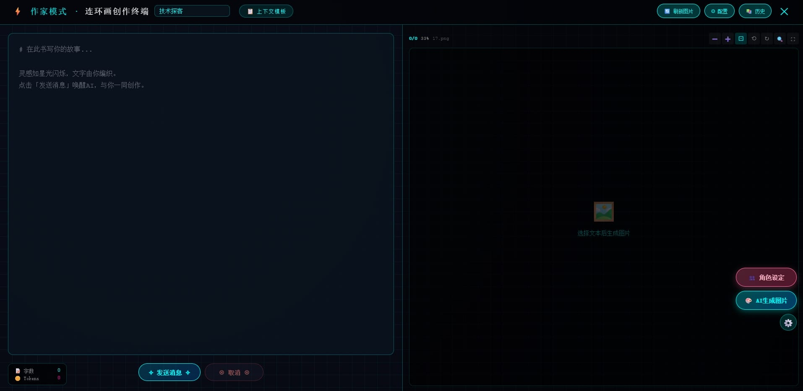

# 📖 作家模式(Writer Mode)

[](https://github.com/your-repo/WriterMode/releases)
[](https://docs.sillytavern.app/)
[](https://opensource.org/licenses/MIT)



---

## ✨ 特性一览

- **🎨 全屏科幻写作环境** — 沉浸式无干扰创作，赛博朋克风格 UI。
- **🤖 多模型 AI 文本生成** — 支持 **KoboldCPP** (本地) 以及 **OpenAI / Claude / DeepSeek** 等远程 API，流式输出。
- **🖼️ 智能连环画配图** — 基于文本片段自动生成图片 (ComfyUI)，并绑定到文本位置。
- **👥 角色 / 场景设定** — 为每个故事独立维护角色描述，AI 生成图片时自动融入，保证一致性。
- **📁 本地图片支持** — 自动扫描 `images/故事名/` 文件夹，支持批量加载。
- **🔍 专业图片查看器** — 缩放、旋转、放大镜、全屏、拖拽浏览，快捷键支持。
- **📚 多故事管理** — 创建、重命名、删除故事，历史记录自动保存。
- **📋 上下文模板** — 内置 ChatML / 思考标签，支持自定义模板快速插入。
- **⚙️ 工作流编辑器** — 支持自定义 ComfyUI 工作流 (JSON)，自动检测提示词节点。

---

## 🚀 安装指南

### 前置要求
- [SillyTavern](https://github.com/SillyTavern/SillyTavern) (v1.12+)
- (可选) [KoboldCPP](https://github.com/LostRuins/koboldcpp) 用于本地文本生成
- (可选) [ComfyUI](https://github.com/comfyanonymous/ComfyUI) 用于图像生成

### 安装步骤

1. **克隆或下载** 本仓库到 SillyTavern 的 `plugins` 目录：
   ```bash
   cd /path/to/SillyTavern/plugins
   git clone https://github.com/your-repo/WriterMode.git
或者手动下载并解压到 SillyTavern/plugins/WriterMode。

重启 SillyTavern，扩展会自动加载。您会在界面右下角看到 ✎ 作家模式 按钮。

配置连接 (首次使用)：

点击 ⚙ 配置 按钮。

在 API 配置 中选择本地 (KoboldCPP) 或远程 API (OpenAI/Claude等)。

在 ComfyUI 配置 中填写 ComfyUI 服务地址 (默认 127.0.0.1:8188)。

(可选) 将自定义 ComfyUI 工作流 JSON 文件放入 WriterMode/json/ 文件夹。
```
🎮 快速上手指南
步骤	操作
1	点击 ✎ 作家模式 进入全屏创作界面。
2	在左侧写作区输入故事内容。
3	选中一段文本 (至少 10 个字)，点击右侧 🎨 AI生成图片 按钮。
4	(可选) 点击 👥 角色设定 添加角色外貌/服装描述，生成图片时会自动融入。
5	滚动文本，图片会自动跟随绑定位置切换。
6	使用图片查看器工具栏 (缩放/旋转/放大镜/全屏) 浏览图片。
快捷键
快捷键	功能
Ctrl + Enter	发送消息 / 触发 AI 生成
Esc	关闭作家模式 / 取消生成
M	切换放大镜 (图片查看器)
R	旋转当前图片
F	适应屏幕
鼠标滚轮	缩放
图片
```
⚙️ 配置详解

API 类型

本地 (KoboldCPP)：使用本地运行的 KoboldCPP 服务，无需 API 密钥。

远程 API：支持 OpenAI、Claude (Anthropic)、DeepSeek 以及自定义 OpenAI 兼容端点。

ComfyUI 工作流

默认内置一个标准工作流模板。

将自定义工作流 JSON 文件放入 WriterMode/json/ 文件夹，扩展会自动加载并在配置面板中显示。

支持自动检测提示词节点，也可在「高级编辑」中手动指定节点 ID 和字段名。

存储说明

所有数据 (故事内容、图片、绑定关系、角色设定) 均存储在浏览器本地 (IndexedDB + localStorage)。

图片支持本地文件夹加载：将图片放入 WriterMode/images/故事名/，扩展会自动识别并按顺序加载。
```
📁 项目结构
text
WriterMode/
├── index.js               # 主扩展文件
├── json/                  # 自定义 ComfyUI 工作流 (JSON)
│   └── example.json
├── images/                # 本地图片 (按故事名分目录)
│   └── 我的故事/
│       ├── 01.jpg
│       └── 02.png
└── README.md              # 本文件
```

自带的生图工作流用的是：anima-base-v1.0.safetensors
以及放在comfyui，lora文件夹中，Anima/anima-turbo-lora-v0.2.safetensors中的加速lora。
需要自行下载，当然也可以自己随意配置工作流。

🤝 贡献
欢迎提交 Issue 和 Pull Request！请确保代码风格一致，并附上清晰的变更说明。

Fork 本仓库

创建您的特性分支 (git checkout -b feature/amazing-feature)

提交您的更改 (git commit -m 'Add some amazing feature')

推送到分支 (git push origin feature/amazing-feature)

打开一个 Pull Request

📄 许可证
本项目基于 MIT 许可证 开源，详情请参阅 LICENSE 文件。

🙏 致谢
SillyTavern — 强大的 AI 角色扮演前端。

KoboldCPP — 高效本地文本生成。

ComfyUI — 丰富的自定义工作流。

Built with ❤️ by the community. AI写作，由你创作。

⭐ 如果这个项目对你有帮助，请给我们一个 Star！
